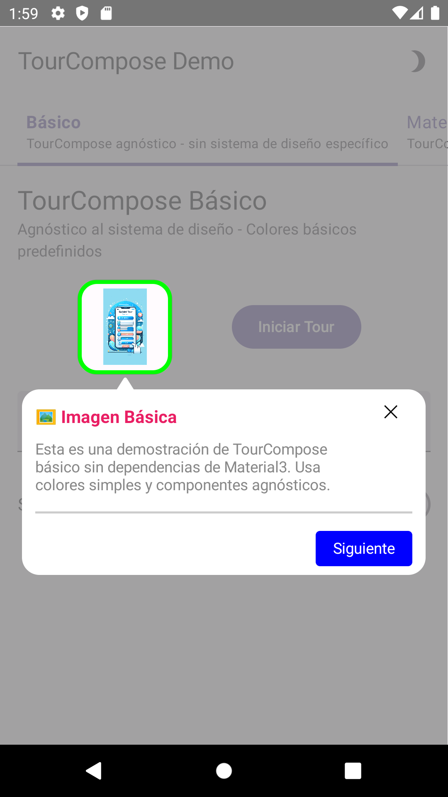
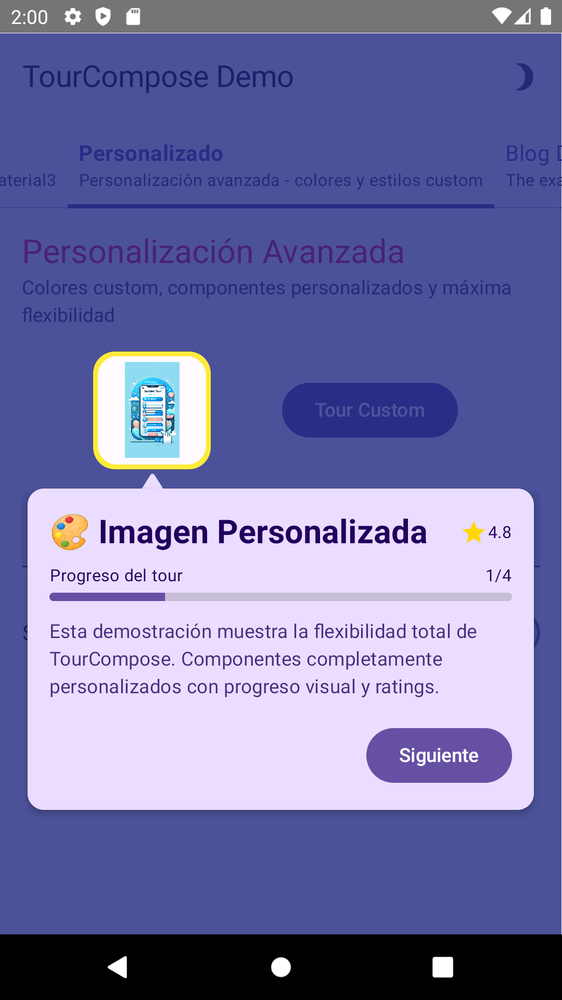
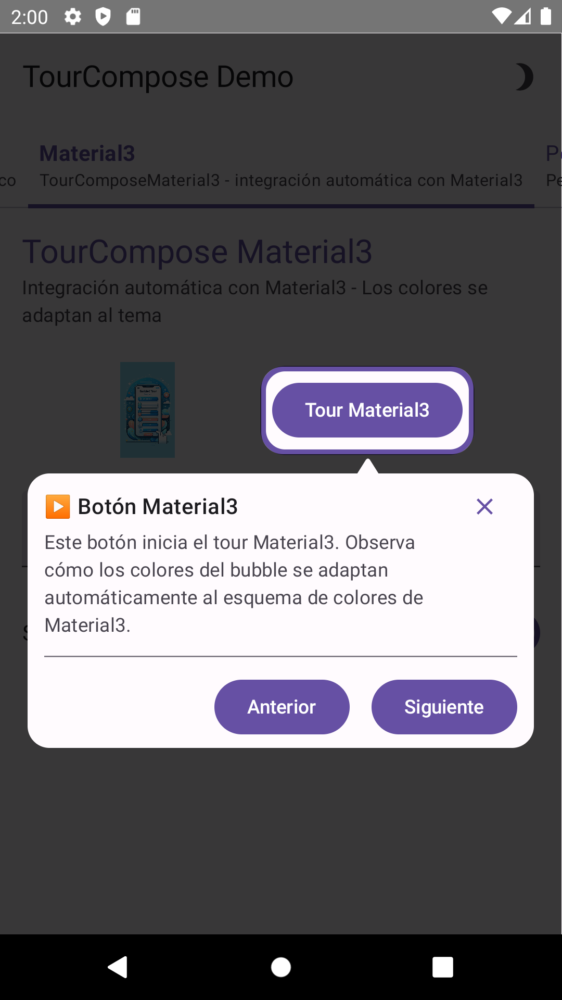
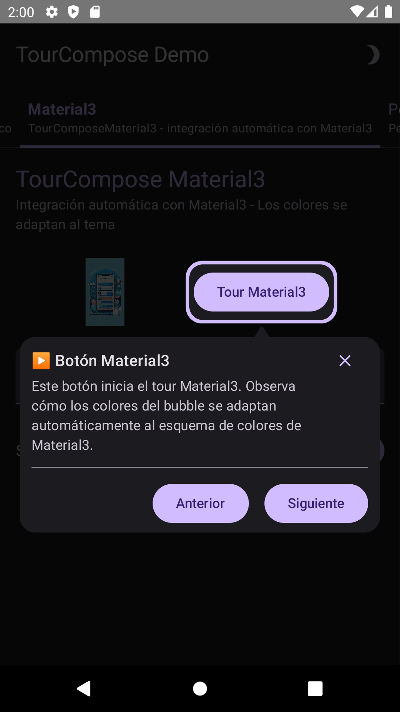

# TourCompose 🎯

[](https://jitpack.io/#AntonioHReyes/TourCompose)
[](https://opensource.org/licenses/MIT)

A powerful and highly customizable tour guide library for Android Compose applications. Create
engaging onboarding experiences with beautiful overlays, smart positioning, and flexible
customization options.

## 🏗️ Architecture

TourCompose is now built with a **design-agnostic architecture** that separates core functionality
from design system implementation:

- 🎨 **TourCompose (Core)** - Design system agnostic base library with all tour functionality
- 🌈 **TourCompose-Material3** - Material3 integration module with automatic theming

**Why design-agnostic?** This architecture allows you to:

- Use TourCompose with any design system (Material3, Material2, custom themes)
- Maintain consistent tour behavior across different UI frameworks
- Keep your app bundle smaller by only including the design dependencies you need
- Create custom design integrations without modifying core tour logic

## ✨ Features

- 🏗️ **Design-agnostic architecture** - Use with any design system or create custom integrations
- 🎨 **Material3 integration** - Optional module with automatic theming support
- 🎯 **Smart positioning** with automatic edge-to-edge detection
- 📱 **Responsive design** that adapts to different screen sizes and orientations
- ⚡ **Performance optimized** with minimal recompositions
- 🧩 **Extensible architecture** for custom bubble content
- 🌙 **Dark mode support** with automatic theme adaptation
- 🎪 **Interactive demos** with multiple customization options
- 💫 **Smooth animations** and transitions
- 🔄 **Tour flow management** with step navigation
- 🎨 **Flexible styling** - Full control over colors, shapes, and animations

## 📱 Screenshots

| Basic Tour                      | Custom Styling                    | Material3 Integration                   | Dark Mode                              |
|---------------------------------|-----------------------------------|-----------------------------------------|----------------------------------------|
|  |  |  |  |

## 🚀 Installation

### Step 1: Add JitPack repository

Add JitPack repository to your root `build.gradle.kts` or `settings.gradle.kts`:

```kotlin
// build.gradle.kts (Project level)
allprojects {
    repositories {
        google()
        mavenCentral()
        maven { url = uri("https://jitpack.io") }
    }
}

// OR in settings.gradle.kts (newer Android projects)
dependencyResolutionManagement {
    repositories {
        google()
        mavenCentral()
        maven { url = uri("https://jitpack.io") }
    }
}
```

### Step 2: Choose your implementation

**Option A: Material3 Integration (Recommended)**
```kotlin
dependencies {
    implementation("com.github.AntonioHReyes.TourCompose:tourcompose-material3:<version>")
    // This automatically includes the base TourCompose library via api dependency
}
```

**Option B: Core library only (Design system agnostic)**
```kotlin
dependencies {
    implementation("com.github.AntonioHReyes.TourCompose:tourcompose:<version>")
    // Use this if you want to create your own design system integration
}
```

**Option C: Both modules (Advanced usage)**
```kotlin
dependencies {
    implementation("com.github.AntonioHReyes.TourCompose:tourcompose:<version>")
    implementation("com.github.AntonioHReyes.TourCompose:tourcompose-material3:<version>")
    // Useful when you need both custom and Material3 designs in the same app
}
```

> **Note**: The Material3 module uses `api` dependency, so you get access to all core TourCompose
> functionality automatically.

## 🏃‍♂️ Quick Start

### 1. Basic Setup

```kotlin
@Composable
fun MainScreen() {
    // Create your tour controller
    val tourController = remember { MyTourController() }

    TourComposeWrapper(
        tourController = tourController
    ) {
        // Access the tour controller anywhere in the tree
        val controller = LocalTourController.current
        val currentStep by controller.currentStep.collectAsState(initial = null)

        // Your main UI content
        MyContent()

        // Tour overlay - shows when tour is active
        TourCompose(
            componentRectArea = currentStep?.componentRect,
            bubbleContentSettings = currentStep?.bubbleContentSettings
        )
    }
}
```

### 2. Create a Tour Controller

```kotlin
class MyTourController : TourComposeController() {

    companion object {
        const val WELCOME_TOUR = "welcome_tour"
        const val FEATURE_TOUR = "feature_tour"
    }

    init {
        // Add your tours
        addTour(
            flowId = WELCOME_TOUR,
            steps = createWelcomeTourSteps()
        )

        addTour(
            flowId = FEATURE_TOUR,
            steps = createFeatureTourSteps()
        )
    }

    private fun createWelcomeTourSteps() = listOf(
        TourComposeStep(
            id = "welcome_step",
            bubbleContentSettings = bubbleContentBasicSettings(
                title = "Welcome to TourCompose! 👋",
                description = "Let's take a quick tour of the main features",
                primaryButtonText = "Start Tour",
                onPrimaryClick = { nextStep() },
                onDismiss = { stopTour() }
            )
        ),
        TourComposeStep(
            id = "button_step",
            bubbleContentSettings = bubbleContentBasicSettings(
                title = "Action Button",
                description = "This button performs the main action",
                primaryButtonText = "Next",
                secondaryButtonText = "Previous",
                onPrimaryClick = { nextStep() },
                onSecondaryClick = { previousStep() },
                onDismiss = { stopTour() }
            )
        ),
        TourComposeStep(
            id = "menu_step",
            bubbleContentSettings = bubbleContentBasicSettings(
                title = "Menu Options",
                description = "Access additional options from here",
                primaryButtonText = "Finish",
                secondaryButtonText = "Back",
                onPrimaryClick = { stopTour() },
                onSecondaryClick = { previousStep() },
                onDismiss = { stopTour() }
            )
        )
    )
}
```

### 3. Mark Target Components

Add the `tourStepIndex` modifier to components you want to highlight:

```kotlin
@Composable
fun TourComposeScope.MyContent() {
    Column {
        // Step 1: Welcome message
        Text(
            modifier = Modifier.tourStepIndex(WELCOME_TOUR, 0),
            text = "Welcome to our app!",
            style = MaterialTheme.typography.headlineMedium
        )

        // Step 2: Action button
        Button(
            modifier = Modifier.tourStepIndex(WELCOME_TOUR, 1),
            onClick = { /* action */ }
        ) {
            Text("Get Started")
        }

        // Step 3: Menu
        IconButton(
            modifier = Modifier.tourStepIndex(WELCOME_TOUR, 2),
            onClick = { /* menu action */ }
        ) {
            Icon(Icons.Default.Menu, contentDescription = "Menu")
        }
    }
}
```

### 4. Start Tours

```kotlin
@Composable
fun StartTourButtons() {
    val tourController = LocalTourController.current

    Row {
        Button(
            onClick = { tourController.startTour(WELCOME_TOUR) }
        ) {
            Text("Start Welcome Tour")
        }

        Button(
            onClick = { tourController.startTour(FEATURE_TOUR) }
        ) {
            Text("Start Feature Tour")
        }
    }
}
```

## 🎨 Customization Examples

### Basic Color Customization

```kotlin
TourCompose(
    componentRectArea = currentStep?.componentRect,
    bubbleContentSettings = currentStep?.bubbleContentSettings,
    tourComposeProperties = TourComposeProperties.getDefaultInstance().copy(
        spotlightColors = defaultSpotlightColors().copy(
            overlayBackgroundColor = MaterialTheme.colorScheme.primary.copy(alpha = 0.8f),
            overlayBorderColor = MaterialTheme.colorScheme.secondary
        ),
        dialogBubbleColors = defaultDialogBubbleColors().copy(
            backgroundColor = MaterialTheme.colorScheme.primaryContainer
        )
    )
)
```

### Advanced Color Theming

```kotlin
// Create custom spotlight colors
val customSpotlightColors = DefaultSpotlightColors(
    overlayBackgroundColor = Color(0xFF6200EE).copy(alpha = 0.7f),
    overlayBorderColor = Color(0xFF03DAC6)
)

// Create custom bubble colors
val customBubbleColors = DefaultDialogBubbleColors(
    backgroundColor = Color(0xFF121212)
)

// Create custom content colors
val customContentColors = defaultBubbleContentColors().copy(
    titleTextColor = Color.White,
    descriptionTextColor = Color.White.copy(alpha = 0.8f),
    iconTintColor = Color(0xFF03DAC6),
    dividerColor = Color.White.copy(alpha = 0.2f)
)

// Apply all customizations
TourCompose(
    componentRectArea = currentStep?.componentRect,
    bubbleContentSettings = currentStep?.bubbleContentSettings,
    tourComposeProperties = TourComposeProperties(
        spotlightColors = customSpotlightColors,
        dialogBubbleColors = customBubbleColors
    )
)
```

### Custom Bubble Content with Progress

```kotlin
@Immutable
class ProgressBubbleContent(
    override val modifier: Modifier = Modifier,
    override val title: String,
    override val description: String,
    val currentStep: Int,
    val totalSteps: Int,
    val progress: Float,
    override val onDismiss: () -> Unit,
    val onNext: () -> Unit,
    val onPrevious: () -> Unit
) : BubbleContentSettings {

    @Composable
    override fun DrawContent(modifier: Modifier) {
        Card(
            modifier = modifier,
            colors = CardDefaults.cardColors(
                containerColor = MaterialTheme.colorScheme.surface,
                contentColor = MaterialTheme.colorScheme.onSurface
            )
        ) {
            Column(
                modifier = Modifier.padding(16.dp),
                verticalArrangement = Arrangement.spacedBy(12.dp)
            ) {
                // Header with title and close button
                Row(
                    modifier = Modifier.fillMaxWidth(),
                    horizontalArrangement = Arrangement.SpaceBetween,
                    verticalAlignment = Alignment.CenterVertically
                ) {
                    Text(
                        text = title,
                        style = MaterialTheme.typography.titleLarge,
                        fontWeight = FontWeight.Bold
                    )

                    IconButton(onClick = onDismiss) {
                        Icon(
                            imageVector = Icons.Default.Close,
                            contentDescription = "Close"
                        )
                    }
                }

                // Progress indicator
                Column {
                    Row(
                        modifier = Modifier.fillMaxWidth(),
                        horizontalArrangement = Arrangement.SpaceBetween
                    ) {
                        Text(
                            text = "Progress",
                            style = MaterialTheme.typography.bodySmall
                        )
                        Text(
                            text = "$currentStep/$totalSteps",
                            style = MaterialTheme.typography.bodySmall
                        )
                    }

                    LinearProgressIndicator(
                        progress = { progress },
                        modifier = Modifier.fillMaxWidth()
                    )
                }

                // Description
                Text(
                    text = description,
                    style = MaterialTheme.typography.bodyMedium
                )

                // Action buttons
                Row(
                    modifier = Modifier.fillMaxWidth(),
                    horizontalArrangement = Arrangement.spacedBy(8.dp, Alignment.End)
                ) {
                    if (currentStep > 1) {
                        OutlinedButton(onClick = onPrevious) {
                            Text("Previous")
                        }
                    }

                    Button(onClick = onNext) {
                        Text(if (currentStep < totalSteps) "Next" else "Finish")
                    }
                }
            }
        }
    }
}

// Usage
fun createProgressTourSteps() = listOf(
    TourComposeStep(
        id = "step1",
        bubbleContentSettings = ProgressBubbleContent(
            title = "Step 1: Getting Started",
            description = "Welcome to our comprehensive tour!",
            currentStep = 1,
            totalSteps = 3,
            progress = 0.33f,
            onNext = { nextStep() },
            onPrevious = { /* no previous */ },
            onDismiss = { stopTour() }
        )
    ),
    // ... more steps
)
```

### Interactive Content with Actions

```kotlin
@Immutable
class InteractiveBubbleContent(
    override val modifier: Modifier = Modifier,
    override val title: String,
    override val description: String,
    val options: List<String>,
    val onOptionSelected: (String) -> Unit,
    override val onDismiss: () -> Unit
) : BubbleContentSettings {

    @Composable
    override fun DrawContent(modifier: Modifier) {
        Card(modifier = modifier) {
            Column(
                modifier = Modifier.padding(16.dp),
                verticalArrangement = Arrangement.spacedBy(8.dp)
            ) {
                Text(
                    text = title,
                    style = MaterialTheme.typography.titleMedium,
                    fontWeight = FontWeight.Bold
                )

                Text(
                    text = description,
                    style = MaterialTheme.typography.bodyMedium
                )

                // Interactive options
                options.forEach { option ->
                    OutlinedButton(
                        onClick = { onOptionSelected(option) },
                        modifier = Modifier.fillMaxWidth()
                    ) {
                        Text(option)
                    }
                }

                // Close button
                TextButton(
                    onClick = onDismiss,
                    modifier = Modifier.align(Alignment.End)
                ) {
                    Text("Skip")
                }
            }
        }
    }
}
```

## 🎯 Use Cases & Examples

### 1. Onboarding Flow

```kotlin
class OnboardingTourController : TourComposeController() {
    init {
        addTour(
            flowId = "onboarding",
            steps = listOf(
                // Welcome step
                TourComposeStep(
                    id = "welcome",
                    bubbleContentSettings = bubbleContentBasicSettings(
                        title = "Welcome to MyApp! 🎉",
                        description = "Let's get you started with a quick tour of the main features",
                        primaryButtonText = "Let's Go!",
                        onPrimaryClick = { nextStep() },
                        onDismiss = { stopTour() }
                    )
                ),

                // Feature discovery
                TourComposeStep(
                    id = "search",
                    bubbleContentSettings = bubbleContentBasicSettings(
                        title = "Search Anything 🔍",
                        description = "Use this search bar to find content quickly and easily",
                        primaryButtonText = "Next",
                        secondaryButtonText = "Skip",
                        onPrimaryClick = { nextStep() },
                        onSecondaryClick = { stopTour() },
                        onDismiss = { stopTour() }
                    )
                ),

                // Call to action
                TourComposeStep(
                    id = "get_started",
                    bubbleContentSettings = bubbleContentBasicSettings(
                        title = "You're All Set! ✅",
                        description = "Start exploring and don't hesitate to check out the help section if you need assistance",
                        primaryButtonText = "Start Exploring",
                        onPrimaryClick = {
                            stopTour()
                            // Navigate to main content or show success message
                        },
                        onDismiss = { stopTour() }
                    )
                )
            )
        )
    }
}
```

### 2. Feature Introduction

```kotlin
class FeatureIntroController : TourComposeController() {
    init {
        addTour(
            flowId = "new_feature",
            steps = listOf(
                TourComposeStep(
                    id = "new_button",
                    bubbleContentSettings = bubbleContentBasicSettings(
                        title = "New Feature Alert! 🆕",
                        description = "We've added a new collaboration feature. Tap here to invite team members!",
                        primaryButtonText = "Try It",
                        secondaryButtonText = "Later",
                        onPrimaryClick = {
                            stopTour()
                            // Open feature or navigate
                        },
                        onSecondaryClick = { stopTour() },
                        onDismiss = { stopTour() }
                    )
                )
            )
        )
    }
}
```

### 3. Help & Tips System

```kotlin
class HelpTourController : TourComposeController() {
    init {
        addTour(
            flowId = "quick_tips",
            steps = listOf(
                TourComposeStep(
                    id = "tip_shortcuts",
                    bubbleContentSettings = bubbleContentBasicSettings(
                        title = "💡 Pro Tip",
                        description = "Long press on items for quick actions and shortcuts",
                        primaryButtonText = "Good to Know",
                        onPrimaryClick = { stopTour() },
                        onDismiss = { stopTour() }
                    )
                )
            )
        )
    }
}
```

### 4. Conditional Tours

```kotlin
@Composable
fun ConditionalTourExample() {
    val tourController = LocalTourController.current
    val isFirstTime = remember { /* check if first time user */ true }
    val hasNewFeatures = remember { /* check for new features */ false }

    LaunchedEffect(isFirstTime, hasNewFeatures) {
        when {
            isFirstTime -> tourController.startTour("onboarding")
            hasNewFeatures -> tourController.startTour("new_features")
        }
    }
}
```

## 🛠️ Advanced Configuration

### Edge-to-Edge Support

TourCompose automatically handles edge-to-edge displays and adjusts positioning accordingly:

```kotlin
// In your MainActivity
class MainActivity : ComponentActivity() {
    override fun onCreate(savedInstanceState: Bundle?) {
        super.onCreate(savedInstanceState)
        enableEdgeToEdge() // TourCompose will automatically adapt

        setContent {
            // Your content - TourCompose handles safe areas automatically
        }
    }
}
```

### Performance Optimization

```kotlin
// Use remember to avoid recreating tour controllers
val tourController = remember { MyTourController() }

// Use keys in remember for dynamic controllers
val dynamicController = remember(userType, featureFlags) {
    createDynamicTourController(userType, featureFlags)
}
```

### Testing Tours

```kotlin
@Test
fun testTourController() {
    val controller = MyTourController()

    // Test tour creation
    controller.startTour("welcome_tour")
    assert(controller.isActive)

    // Test navigation
    controller.nextStep()
    controller.previousStep()

    // Test completion
    controller.stopTour()
    assert(!controller.isActive)
}

@Composable
fun TestTourWrapper(content: @Composable () -> Unit) {
    val testController = remember { TestTourController() }
    TourComposeWrapper(tourController = testController) {
        content()
    }
}
```

## 📚 API Reference

### Core Components

#### TourCompose

Main composable that renders the tour overlay.

```kotlin
@Composable
fun TourCompose(
    tourComposeProperties: TourComposeProperties = TourComposeProperties.getDefaultInstance(),
    componentRectArea: Rect?,
    bubbleContentSettings: BubbleContentSettings?
)
```

#### TourComposeWrapper

Provides tour controller context to the composition tree.

```kotlin
@Composable
fun TourComposeWrapper(
    tourController: TourComposeController,
    content: @Composable TourComposeScope.() -> Unit
)
```

#### TourComposeController

Base class for managing tour logic and state.

```kotlin
abstract class TourComposeController {
    fun startTour(flowId: String)
    fun stopTour()
    fun nextStep()
    fun previousStep()
    fun addTour(flowId: String, steps: List<TourComposeStep>)

    val currentStep: StateFlow<TourComposeStep?>
    val isActive: Boolean
}
```

### Configuration Classes

#### TourComposeProperties

Main configuration object for customizing appearance.

```kotlin
data class TourComposeProperties(
    val spotlightColors: SpotlightColors,
    val dialogBubbleColors: DialogBubbleColors
)
```

#### SpotlightColors

Customizes the overlay and spotlight appearance.

```kotlin
interface SpotlightColors {
    val overlayBackgroundColor: Color
    val overlayBorderColor: Color
}
```

#### DialogBubbleColors

Customizes the bubble background.

```kotlin
interface DialogBubbleColors {
    val backgroundColor: Color
}
```

#### BubbleContentColors

Customizes text and icon colors within bubbles.

```kotlin
interface BubbleContentColors {
    val titleTextColor: Color
    val descriptionTextColor: Color
    val iconTintColor: Color
    val dividerColor: Color
}
```

### Content Interfaces

#### BubbleContentSettings

Interface for creating custom bubble content.

```kotlin
interface BubbleContentSettings {
    val modifier: Modifier
    val title: String
    val description: String
    val onDismiss: () -> Unit

    @Composable
    fun DrawContent(modifier: Modifier)
}
```

### Helper Functions

#### bubbleContentBasicSettings

Creates basic bubble content with standard layout.

```kotlin
fun bubbleContentBasicSettings(
    modifier: Modifier = Modifier,
    title: String,
    description: String,
    primaryButtonText: String? = null,
    secondaryButtonText: String? = null,
    onDismiss: () -> Unit = {},
    onPrimaryClick: () -> Unit = {},
    onSecondaryClick: () -> Unit = {},
    colors: BubbleContentColors? = null
): BubbleContentSettings
```

#### Default Color Functions

Create default color schemes that adapt to Material Theme.

```kotlin
@Composable
fun defaultSpotlightColors(): SpotlightColors

@Composable
fun defaultDialogBubbleColors(): DialogBubbleColors

@Composable
fun defaultBubbleContentColors(): BubbleContentColors
```

### Modifiers

#### tourStepIndex

Marks components as tour targets.

```kotlin
fun Modifier.tourStepIndex(flowId: String, stepIndex: Int): Modifier
```

## 🔧 Requirements

- **Android API 24+** (Android 7.0)
- **Kotlin 1.8+**
- **Compose BOM 2023.06.01+**
- **Material 3** components

## 🤝 Contributing

We welcome contributions!

### Development Setup

1. Clone the repository
2. Open in Android Studio
3. Run the demo app to see examples
4. Make your changes
5. Add tests for new features
6. Submit a pull request

## 📄 License

```
MIT License

Copyright (c) 2024 Antonio Huerta

Permission is hereby granted, free of charge, to any person obtaining a copy
of this software and associated documentation files (the "Software"), to deal
in the Software without restriction, including without limitation the rights
to use, copy, modify, merge, publish, distribute, sublicense, and/or sell
copies of the Software, and to permit persons to whom the Software is
furnished to do so, subject to the following conditions:

The above copyright notice and this permission notice shall be included in all
copies or substantial portions of the Software.

THE SOFTWARE IS PROVIDED "AS IS", WITHOUT WARRANTY OF ANY KIND, EXPRESS OR
IMPLIED, INCLUDING BUT NOT LIMITED TO THE WARRANTIES OF MERCHANTABILITY,
FITNESS FOR A PARTICULAR PURPOSE AND NONINFRINGEMENT. IN NO EVENT SHALL THE
AUTHORS OR COPYRIGHT HOLDERS BE LIABLE FOR ANY CLAIM, DAMAGES OR OTHER
LIABILITY, WHETHER IN AN ACTION OF CONTRACT, TORT OR OTHERWISE, ARISING FROM,
OUT OF OR IN CONNECTION WITH THE SOFTWARE OR THE USE OR OTHER DEALINGS IN THE
SOFTWARE.
```

## 💬 Support

- 📧 Email: develop@tonyakitori.com
- 🐛 Issues: [GitHub Issues](https://github.com/AntonioHReyes/TourCompose/issues)

## Buy me a coffee

[](https://www.paypal.com/donate/?hosted_button_id=6RV93BSM8E364)

## 🙏 Acknowledgments

- Built with ❤️ using [Jetpack Compose](https://developer.android.com/jetpack/compose)
- Inspired by the need for better onboarding experiences in mobile apps
- Thanks to the Android community for feedback and contributions

---

**Made with ❤️ by [Antonio Huerta](https://github.com/AntonioHReyes)**